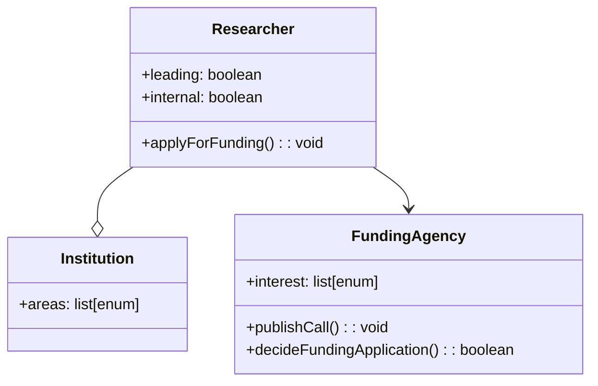
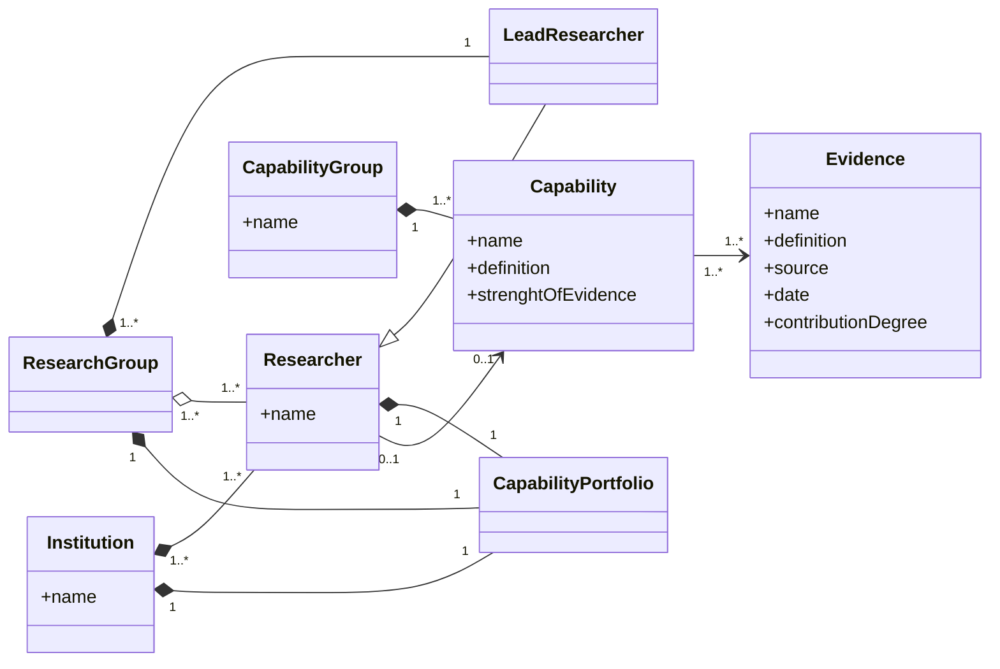

# Context Specification

_The context specification defines the context of the Capability Matrix System including a specification of the overall project scope, the stakeholders, rules, goals, and constraints as well as a specification of the domain model._

## Project Scope

_Problem description and a statement of intent, i.e. a conclusion of the objectives of a potentially resulting project._

Problem Descriptions: A Researcher o-- CapabilityPortfolioresearch group is defined by the capabilities of its individual members. Making these capabilities explicit allows the group to identify opportunities to collaborate in research applications, strategically expand its capabilities by recruitment efforts, and visualize individual and cluster-wise capabilities. The following challenges are considered in scope of this project:

1. Understanding of capabilities: Capabilities are hard to grasp, systematically elicit, and distinguish.
2. Recording capabilities: Specifying which capabilities a researcher has to which degree is tedious.
3. Maintaining capabilities: Keeping capabilities and the extent to which they are obtained up-to-date is impossible without a framework.
4. Communicating capabilities: It is difficult to visualize the capability profile (1) of a single researcher as well as (2) of a research group.

Statement of Intent: A system that both helps to undestand and frame capabilities of a specific research domain (e.g., requirements engineering), but also assists recording, maintaining, and communicating these abilities to external stakeholders and potential collaborators.

## Stakeholder Model

_Stakeholders comprehend individuals, groups, or institutions having the responsibility for requirements and a major interest in the project. User groups are a specialisation of  stakeholders interacting with the system._

## Objectives and Goals 

_Each goal, whether it is a business goal, a usage goal, or a system goal, is issued by a stakeholder. Goals satisfy the statement of intent, they build a hierarchy, and they can influence each other in terms of conflicts, constraints, or support._

| ID | Stakeholder | Goal | Type |
|---|---|---|---|
| | Researcher | Getting an overview of the capabilities of a research group | Usage |
| | Lead researcher | Identifying missing capabilities in a research group for targeted hiring | Usage |
| | Researcher | Keeping capability records up-to-date | System |
| | Researcher | Identifying collaborators with specific capabilities to answer a funding call | Usage |
| | Researcher | Visualizing a personal capability portfolio | Business |
| | Institution | Visualizing success of own research groups | Business |
| | Funding Agency | Assessing the academic profile of a researcher | Usage |

## Domain Model

