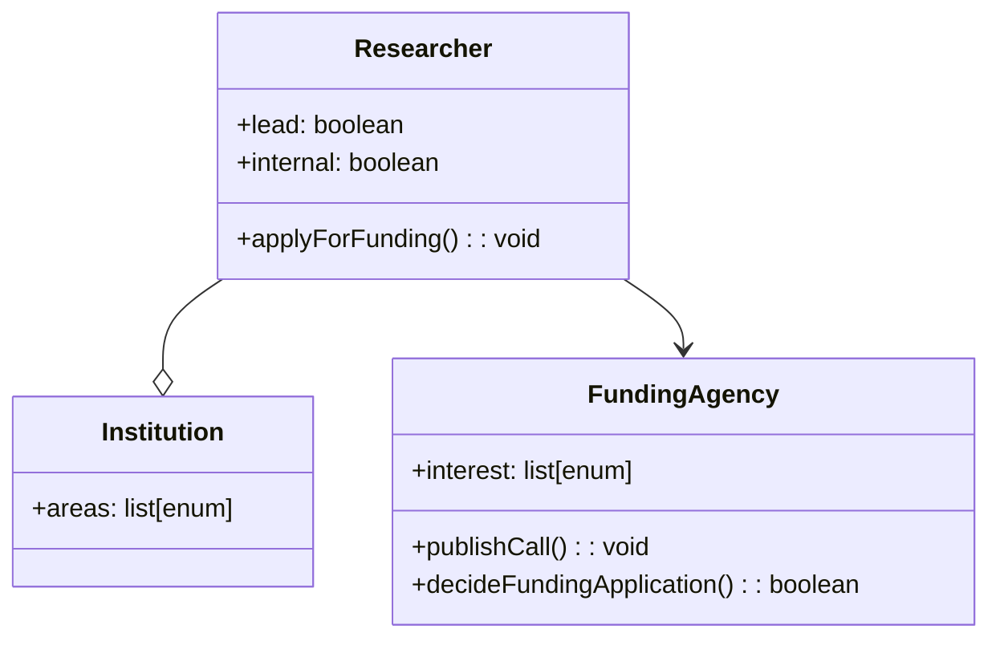

# Context Specification

_The context specification defines the context of the Capability Matrix System including a specification of the overall project scope, the stakeholders, rules, goals, and constraints as well as a specification of the domain model._

## Project Scope

_Problem description and a statement of intent, i.e. a conclusion of the objectives of a potentially resulting project._

**Problem:** Representing the knowledge and abilities of a research group is difficult yet vital for outreach, coordination, and presentation. **Solution:** Through the Capability Matrix System, a research group can organize and visualize their capabilities in a harmonized and accessible manner.

## Stakeholder Model

_Stakeholders comprehend individuals, groups, or institutions having the responsibility for requirements and a major interest in the project. User groups are a specialisation of  stakeholders interacting with the system._

## Objectives and Goals 

_Each goal, whether it is a business goal, a usage goal, or a system goal, is issued by a stakeholder. Goals satisfy the statement of intent, they build a hierarchy, and they can influence each other in terms of conflicts, constraints, or support._

| ID | Stakeholder | Goal | Type |
|---|---|---|---|
| G1 | Researcher | Getting an overview over the capabilities of a research group | Usage |
| G2 | Researcher | Conveniently maintaing a profile of ones own capabilities | System |
| G3 | Researcher (lead, internal) | Determining eligible group members to answer a funding call | Usage |
| G4 | Institution | Visualizing success of own research groups | Business |
| G5 | Funding Agency | Assessing the academic profile of a researcher | Usage |