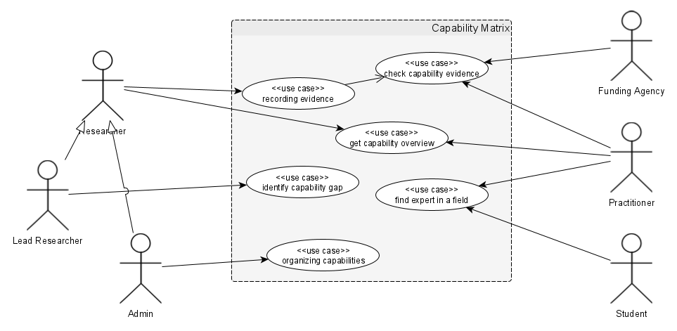

# Requirements Specification

_The requirements specification comprehends the requirements on the system under consideration by taking a black-box view on the system. This means, we specify requirements from a user's perspective without constraining (or even without having to understand) the internal realisation of the system. This comprehends, for example, use cases (or user stories, depending on preferences and choices), and non-functional requirements._

## System Vision

_The system vision comprehends the system context of the system under consideration, which is intended to realise a number of features. A feature is a prominent or distinctive user-recognisable aspect, quality, or characteristic of a system. In addition, we specify an use case overview, i.e. a (potentially) graphical overview of the use cases._

### Mapping

The use cases fulfill the goals in the following way:

| UC | Fulfilled Goals |
|---|---|
| UC1 | G3 |
| UC2 | G7 |
| UC3 | G1, G5, G6, G9 |
| UC4 | G2 |
| UC5 | G4, G8 |
| UC6 | |

The goals G10-G12 are currently not addressed by any use case.

## Usage Model

_This content item details the use case overview of the system vision in its use cases. We distinguish services and use cases (or user stories respectively). Both concepts are means to describe (black box) system behaviour. Use cases describe sequences of interaction between actors (realising user groups) and the system as a whole._

### UC1: Recording Evidence

| UC1 | Recording Evidence |
|---|---|
| Actors | Researcher |
| Pre-conditions | The researcher is authenticated and has a valid, digital evidence |
| End conditions (success) | The evidence is recorded and associated with the researcher |
| End conditions (failure) | The evidence is either not recorded or not associated with the researcher |
| Steps | 1. If a researcher presses "Add evidence", the system opens a dialog window with a dropdown menu for the evidence type. |
| | 2. When the researcher selects the evidence type, the dialog window is populated with input fields of the respective attributes of the evidence type. |
| | 3. When all mandatory input fields contain valid values and the the researcher presses "Confirm", the system records the evidence and associates it with the researcher. |
| Extensions | 2.b. If the researcher presses "Report missing evidence", the system forwards them to an issue reporting interface. |

### UC2: Check capability evidence

### UC3: Get capability overview

### UC4: Identify capability gap

### UC5: Find expert in a field

### UC6: Organizing capabilities